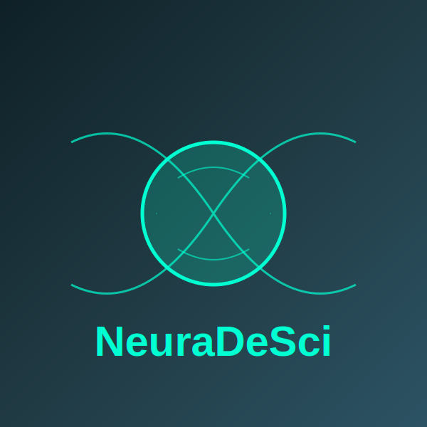

# NeuraDeSci



NeuraDeSci is a decentralized platform for neuroscience research data management, leveraging blockchain technology to enable secure and transparent sharing of research data.

## Project Overview

NeuraDeSci is a decentralized neuroscience research platform built on Web3 technology, designed to revolutionize traditional neuroscience research paradigms. Through blockchain technology, smart contracts, and decentralized storage, we're building an open, transparent, and efficient scientific ecosystem that allows neuroscience researchers worldwide to freely collaborate, share data and results, while receiving fair incentives and recognition.

### Our Mission

Connect neuroscientists globally, accelerate brain research, and advance human understanding of consciousness and cognition.

### First Principles Thinking

NeuraDeSci is built on the following first principles:

1. **Knowledge Sharing Principle**: Scientific discoveries should be open and accessible
2. **Transparency Principle**: Research processes and data should be transparent and verifiable
3. **Incentive Alignment Principle**: Contributors should receive rewards proportional to the value of their contributions
4. **Decentralized Governance Principle**: Scientific decisions should be made collaboratively by the community
5. **Composability Principle**: Research tools and data should be freely composable, creating new research possibilities

## Core Features

### 1. Decentralized Data Sharing & Management

- IPFS and Filecoin storage for large-scale neuroscience datasets
- Blockchain-based data provenance and access control
- Encrypted data sharing mechanisms protecting sensitive data privacy
- Data quality validation and reputation systems

### 2. Open Scientific Collaboration Network

- Decentralized Identity System (DID) connecting researchers globally
- Smart contract-based collaboration workflows
- Real-time research progress tracking and milestone recording
- Cross-disciplinary collaboration matching algorithms

### 3. Tokenized Incentive Model

- NDS token economy system incentivizing research contributions
- Token distribution mechanisms based on contribution value
- Multi-role incentive design for participants
- Sustainable research funding pools

### 4. Open Research Publishing

- Decentralized paper publishing system
- Consensus-based peer review mechanisms
- NFT-certified research outputs and intellectual property
- Research impact tracking system

### 5. Decentralized Neuroscience DAO

- Community governance structure
- Proposal and voting systems
- Research direction and funding allocation decisions
- Cross-institutional collaboration frameworks

## Technical Architecture

NeuraDeSci employs a multi-layer technical architecture:

1. **Base Layer**: Ethereum blockchain, IPFS/Filecoin storage
2. **Protocol Layer**: Identity protocols, data sharing protocols, incentive protocols
3. **Application Layer**: Research tools, data analysis platforms, collaboration interfaces
4. **Interaction Layer**: User interfaces, APIs, developer tools

## Roadmap

### Phase 1: Foundation Building (2025 Q1 - Q2)

- [ ] Complete proof of concept and whitepaper
- [ ] Assemble core team and advisor network
- [ ] Develop platform MVP
- [ ] Establish initial partnerships

### Phase 2: Testnet (2025 Q3 - 2026 Q1)

- [ ] Launch testnet and early user projects
- [ ] Complete core smart contract development and audits
- [ ] Implement data sharing protocols
- [ ] Develop collaboration tools and user interface

### Phase 3: Mainnet Launch (2026 Q2 - Q3)

- [ ] Mainnet goes live
- [ ] Token generation event
- [ ] Launch first research grant programs
- [ ] Establish neuroscience DAO

### Phase 4: Ecosystem Expansion (2026 Q4 - 2027 Q2)

- [ ] Integrate AI analysis tools
- [ ] Expand to more neuroscience sub-fields
- [ ] Launch cross-disciplinary collaboration projects
- [ ] Develop mobile applications and APIs

### Phase 5: Global Expansion (2027 Q3 and beyond)

- [ ] Expand to more languages and regions
- [ ] Establish regional collaboration hubs
- [ ] Develop advanced research tools and analytics platforms
- [ ] Implement more sophisticated DAO governance mechanisms

## Technology Stack

- **Frontend**: React.js, Next.js
- **Smart Contracts**: Solidity
- **Decentralized Storage**: IPFS
- **High-Performance Core**: Rust (WebAssembly)
- **Styling**: Tailwind CSS

## Features

- Secure storage and sharing of neuroscience research data
- Blockchain-based data provenance and access control
- Decentralized identity for researchers
- High-performance data processing with Rust and WebAssembly
- Interactive visualizations for neural data

## Rust Integration

The project now includes high-performance Rust components that are compiled to WebAssembly, enabling:

- Efficient neural data processing directly in the browser
- Secure cryptographic operations
- Decentralized storage via IPFS
- Integration with blockchain technology
- Cross-platform compatibility

For more information on the Rust components, see the [rust-components README](rust-components/README.md).

## Getting Started

1. Clone the repository:
```bash
git clone https://github.com/NeuraDeSci/NeuraDeSci.git
cd NeuraDeSci
```

2. Install dependencies:
```bash
npm install
```

3. Build the Rust components (requires Rust and wasm-pack):
```bash
cd rust-components
./build.sh
cd ..
```

4. Run the development server:
```bash
npm run dev
```

## License

This project is licensed under the MIT License.

Copyright (c) 2025 NeuraDeSci

Permission is hereby granted, free of charge, to any person obtaining a copy
of this software and associated documentation files (the "Software"), to deal
in the Software without restriction, including without limitation the rights
to use, copy, modify, merge, publish, distribute, sublicense, and/or sell
copies of the Software, and to permit persons to whom the Software is
furnished to do so, subject to the following conditions:

The above copyright notice and this permission notice shall be included in all
copies or substantial portions of the Software.

THE SOFTWARE IS PROVIDED "AS IS", WITHOUT WARRANTY OF ANY KIND, EXPRESS OR
IMPLIED, INCLUDING BUT NOT LIMITED TO THE WARRANTIES OF MERCHANTABILITY,
FITNESS FOR A PARTICULAR PURPOSE AND NONINFRINGEMENT. IN NO EVENT SHALL THE
AUTHORS OR COPYRIGHT HOLDERS BE LIABLE FOR ANY CLAIM, DAMAGES OR OTHER
LIABILITY, WHETHER IN AN ACTION OF CONTRACT, TORT OR OTHERWISE, ARISING FROM,
OUT OF OR IN CONNECTION WITH THE SOFTWARE OR THE USE OR OTHER DEALINGS IN THE
SOFTWARE. 